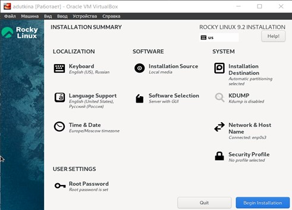

---
## Front matter
lang: ru-RU
title: Лабораторная работа №1
subtitle: Установка и конфигурация операционной системы на виртуальную машину
author:
  - Уткина А. Д.
institute:
  - Российский университет дружбы народов, Москва, Россия
date: 17 февраля 2024

## i18n babel
babel-lang: russian
babel-otherlangs: english

## Formatting pdf
toc: false
toc-title: Содержание
slide_level: 2
aspectratio: 169
section-titles: true
theme: metropolis
header-includes:
 - \metroset{progressbar=frametitle,sectionpage=progressbar,numbering=fraction}
 - '\makeatletter'
 - '\beamer@ignorenonframefalse'
 - '\makeatother'
---

# Вводная часть

## Цель работы

Целью данной работы является приобретение практических навыков установки операционной системы на виртуальную машину, настройки минимально необходимых для дальнейшей работы сервисов.

# Выполнение лабораторной работы
 	
## Установка виртуальной машины

- Скачиваем с сайта разработчика DVD-образ операционной системы (Rocky);
- Устанавливаем имя и версию системы;
- Указываем объем основной памяти 2048МБ и размер виртуального диска 40ГБ;

## Настройка виртуальной машины

- Выполняем необходимую настройку

## Ввыполнение домашнего задания

После загрузки виртуальной машины нужно было определить некоторые характеристики:

1. Версия ядра Linux;
2. Частота процессора;
3. Модель процессора;
4. Объем доступной оперативной памяти;
5. Тип обнаруженного гипервизора;
6. Тип файловой системы корневого раздела;
7. Последовательность монтирования файловых систем.

# Вывод

В ходе данной лабораторной работы были приобретены практические навыки установки операционной системы на виртуальную машину, настройки минимально необходимых для дальнейшей работы сервисов.

