---
## Front matter
title: "Лабораторная работа №1"
author: "Уткина Алина Дмитриевна"

## Generic otions
lang: ru-RU
toc-title: "Содержание"

## Bibliography
bibliography: bib/cite.bib
csl: pandoc/csl/gost-r-7-0-5-2008-numeric.csl

## Pdf output format
toc: true # Table of contents
toc-depth: 2
lof: true # List of figures
fontsize: 12pt
linestretch: 1.5
papersize: a4
documentclass: scrreprt
## I18n polyglossia
polyglossia-lang:
  name: russian
  options:
	- spelling=modern
	- babelshorthands=true
polyglossia-otherlangs:
  name: english
## I18n babel
babel-lang: russian
babel-otherlangs: english
## Fonts
mainfont: PT Sans
romanfont: PT Sans
sansfont: PT Sans
monofont: PT Sans
mainfontoptions: Ligatures=TeX
romanfontoptions: Ligatures=TeX
sansfontoptions: Ligatures=TeX,Scale=MatchLowercase
monofontoptions: Scale=MatchLowercase,Scale=0.9
## Biblatex
biblatex: true
biblio-style: "gost-numeric"
biblatexoptions:
  - parentracker=true
  - backend=biber
  - hyperref=auto
  - language=auto
  - autolang=other*
  - citestyle=gost-numeric
## Pandoc-crossref LaTeX customization
figureTitle: "Рис."
tableTitle: "Таблица"
listingTitle: "Листинг"
lofTitle: "Список иллюстраций"
lotTitle: "Список таблиц"
lolTitle: "Листинги"
## Misc options
indent: true
header-includes:
  - \usepackage{indentfirst}
  - \usepackage{float} # keep figures where there are in the text
  - \floatplacement{figure}{H} # keep figures where there are in the text
---

# Цель работы

Целью данной работы является приобретение практических навыков установки операционной системы на виртуальную машину, настройки минимально необходимых для дальнейшей работы сервисов.

# Выполнение лабораторной работы

Скачиваем с сайта разработчика DVD-образ операционной системы, соответствующий архитектуре компьютера (рис. [-@fig:001]).

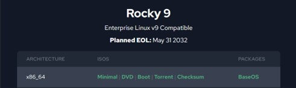{#fig:001 width=70%}

Создадим новую виртуальную машину в VirtualBox. Для этого укажем имя виртуальной машины, тип операционной системы и версию операционной системы, также укажем путь к iso-образу устанавливаемого дистрибутива (рис. [-@fig:002]).

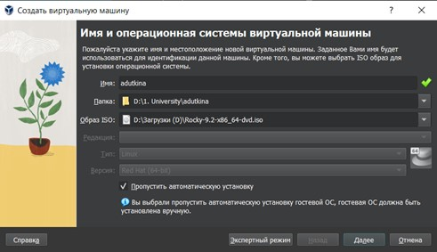{#fig:002 width=70%}

Укажем размер основной памяти виртуальной машины – 2048МБ и число процессоров, например 1 или 2  (рис. [-@fig:003]).

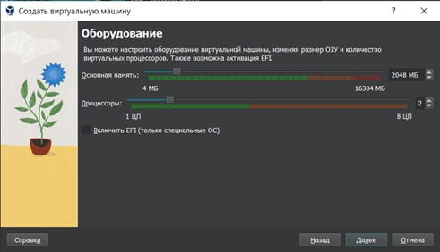{#fig:003 width=70%}

Зададим размер виртуального диска – 40ГБ (рис. [-@fig:004]).

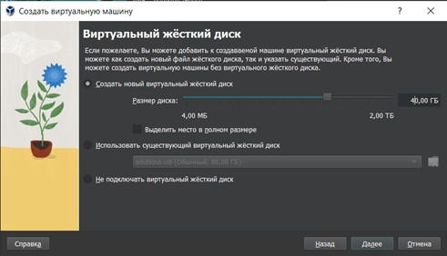{#fig:004 width=70%}

Запустим виртуальную машину и в окне с меню переключимся на строку «Install Rocky Linux», нажмем Enter для запуска установки образа ОС (рис. [-@fig:005]).

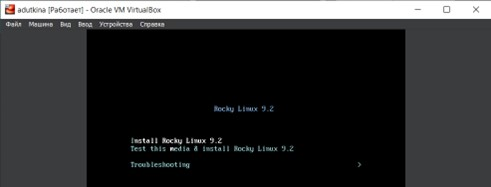{#fig:005 width=70%}

Выберем английский язык интерфейса ОС, проверим часовой пояс, добавим русскую раскладку клавиатуры и ее переключение с помощью сочетания Alt+Shift, добавим поддержку русского языка и в разделе программ укажем в качестве базового окружения Server with GUI, а в качестве дополнения – Development Tools, отключим KDUMP, установим пароль для root пользователя и разрешение на ввод пароля для root при использовании SSH. Затем зададим локального пользователя с правами администратора и пароль для него (рис. [-@fig:006]).

После задания необходимых настроек нажмем на Begin Installation для начала установки образа системы и перезапустим виртуальную машину.
 
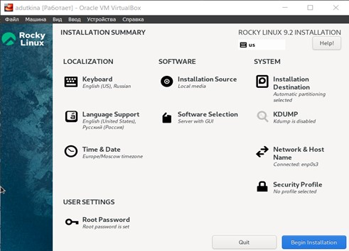{#fig:006 width=70%}

Войдем в ОС под заданной учётной записью. В меню Устройства виртуальной машины подключим образ диска дополнений гостевой ОС (рис. [-@fig:007]). После загрузки дополнений Enter и перезагрузим виртуальную машину.
 
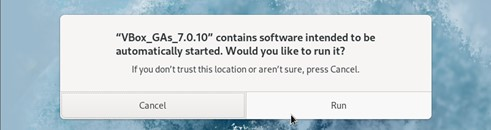{#fig:007 width=70%}

# Домашнее задание

Дождемся загрузки графического окружения и откроем терминал. Проанализируем последовательность загрузки системы, выполнив команду dmesg. (Можно просто просмотреть вывод этой команды: dmesg | less). Для поиска информации можно использовать grep: dmesg | grep -i “то, что ищем”.

Получим следующую информацию:

1. Версия ядра Linux (рис. [-@fig:008]);
2. Частота процессора (рис. [-@fig:009]);
3. Модель процессора (рис. [-@fig:010]);
4. Объем доступной оперативной памяти (рис. [-@fig:011]);
5. Тип обнаруженного гипервизора (рис. [-@fig:012]);
6. Тип файловой системы корневого раздела (рис. [-@fig:013]);
7. Последовательность монтирования файловых систем (рис. [-@fig:014]).

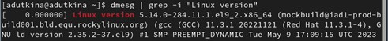{#fig:008 width=70%}

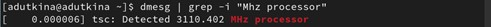{#fig:009 width=70%}

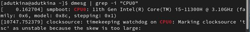{#fig:010 width=70%}

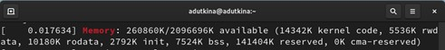{#fig:011 width=70%}

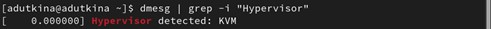{#fig:012 width=70%}

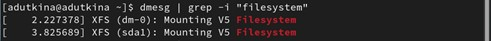{#fig:013 width=70%}

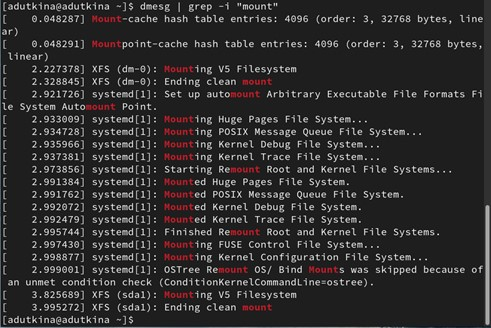{#fig:014 width=70%}

# Контрольные вопросы

1. Какую информацию содержит учётная запись пользователя? – Учетная запись пользователя содержит имя, пароль и активность учетной записи (рис. [-@fig:015]).

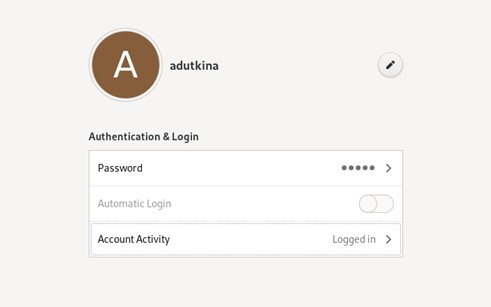{#fig:015 width=70%}

2. Команды терминала и примеры их использования:

– для получения справки по команде используется –help (рис. [-@fig:016]);
– для перемещения по файловой системе используется cd (рис. [-@fig:017]);
– для просмотра содержимого каталога используется ls (рис. [-@fig:018]);
– для определения объёма каталога можно использовать команду du с ключем -sm (для отображения объема в мегабайтах) (рис. [-@fig:019]);
– для создания каталогов используется mkdir (-p для создания каталога в каталоге), для создания файлов - touch, для удаления и каталогов, и файлов можно использовать rm (-r для рекурсивного удаления каталогов) (рис. [-@fig:020]);
– для задания определённых прав на файл/каталог можно использовать команду chmod (для задания различных прав можно использовать значения в восьмиричной системе, например разрешить все права для пользователя (rwx) - 111 = 7) (рис. [-@fig:021]);
– для просмотра истории команд используется history (рис. [-@fig:022]).

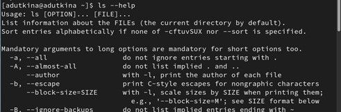{#fig:016 width=70%}
 
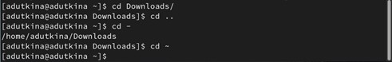{#fig:017 width=70%}

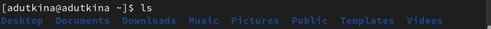{#fig:018 width=70%}

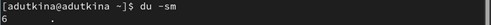{#fig:019 width=70%} 

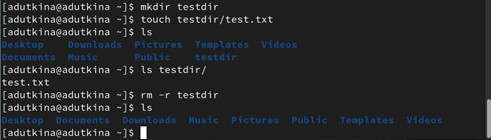{#fig:020 width=70%} 

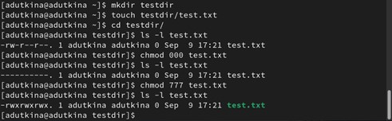{#fig:021 width=70%} 
 
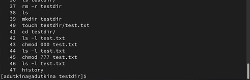{#fig:022 width=70%}

3. Что такое файловая система? – Файловая система - средство организации хранения файлов на каком-либо носителе.
Примеры:
• NTFS (ОС “Windows”) разрабатывалась с целью обеспечения скоростного выполнения стандартных операций над файлами (чтение, запись, поиск) и предоставления продвинутых возможностей включая восстановление повреждений файловой системы на больших дисках;
• Ext3 (ОС “Linux”) соблюдает обычные стандарты для файловых систем UNIX-типа, является усовершенствованной файловой системой Ext2, предназначена для дальнейшего развития, сохраняя при этом хорошую производительность;

4. Как посмотреть, какие файловые системы подмонтированы в ОС? – Для отображения файловых систем можно использовать findmnt, которая отображает целевую точку монтирования (TARGET), исходного устройство (SOURCE), тип файловой системы (FSTYPE) и соответствующие параметры монтирования (OPTIONS) для каждой файловой системы (рис. [-@fig:023]);

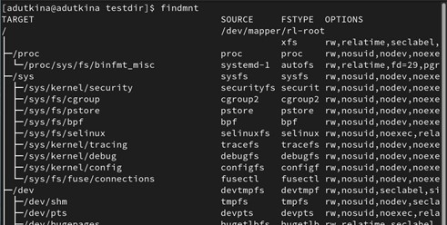{#fig:023 width=70%}

5. Как удалить зависший процесс? – Удалить зависший процесс можно с помощью комбинации Ctrl+C (остановить процесс), Ctrl+Z (приостановить процесс) (рис. [-@fig:024]).
 
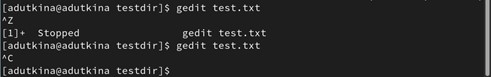{#fig:024 width=70%}

# Выводы

В ходе данной лабораторной работы были приобретены практические навыки установки операционной системы на виртуальную машину, настройки минимально необходимых для дальнейшей работы сервисов.
