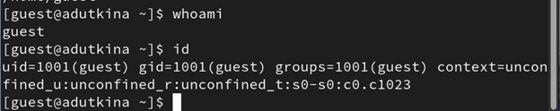
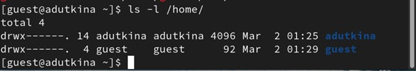
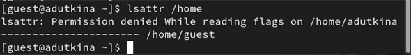
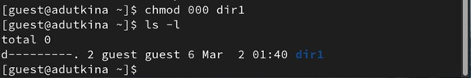
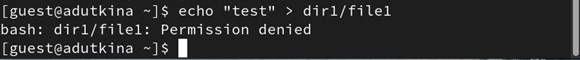
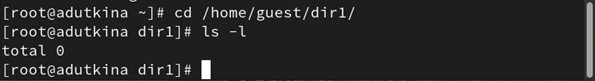
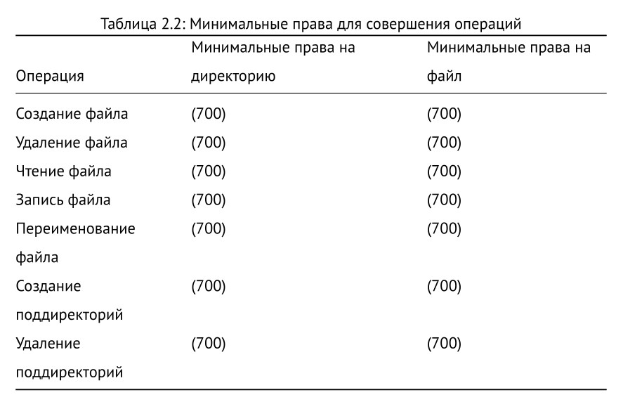

---
## Front matter
lang: ru-RU
title: Лабораторная работа №2 
subtitle: Дискреционное разграничение прав в Linux. Основные атрибуты
author:
  - Уткина А. Д.
institute:
  - Российский университет дружбы народов, Москва, Россия
date: 02 марта 2024

## i18n babel
babel-lang: russian
babel-otherlangs: english

## Formatting pdf
toc: false
toc-title: Содержание
slide_level: 2
aspectratio: 169
section-titles: true
theme: metropolis
header-includes:
 - \metroset{progressbar=frametitle,sectionpage=progressbar,numbering=fraction}
 - '\makeatletter'
 - '\beamer@ignorenonframefalse'
 - '\makeatother'
---

# Информация

## Докладчик

:::::::::::::: {.columns align=center}
::: {.column width="70%"}

  * Уткина Алина Дмитриевна
  * студент НПИбд-02-22
  * Российский университет дружбы народов
  
:::
::: {.column width="30%"}

:::
::::::::::::::

# Вводная часть

## Цели и задачи

- Целью данной работы является получение практических навыков работы в консоли с атрибутами файлов, закрепление теоретических основ дискреционного разграничения доступа в современных системах с открытым кодом на базе ОС Linux1.

# Выполнение работы

## Создание учетной записи пользователя

- Создаем пользователя guest
- Устанавливаем пароль учетной записи
- Вывод инормации о пользователе и его группах

## Работа с правами доступа к директориям

## Выполнение различных действий с различными уровнями прав доступа

## Заполнение таблицы

# Результаты

## Вывод

В ходе лабораторной работы были получены практические навыки работы в консоли с атрибутами файлов, закрепление теоретических основ дискреционного разграничения доступа в современных системах с открытым кодом на базе ОС Linux1.

