---
## Front matter
title: "Отчёт по лабораторной работе №2"
subtitle: "Дискреционное разграничение прав в Linux. Основные атрибуты"
author: "Уткина Алина Дмитриевна"

## Generic otions
lang: ru-RU
toc-title: "Содержание"

## Bibliography
bibliography: bib/cite.bib
csl: pandoc/csl/gost-r-7-0-5-2008-numeric.csl

## Pdf output format
toc: true # Table of contents
toc-depth: 2
lof: true # List of figures
lot: true # List of tables
fontsize: 12pt
linestretch: 1.5
papersize: a4
documentclass: scrreprt
## I18n polyglossia
polyglossia-lang:
  name: russian
  options:
	- spelling=modern
	- babelshorthands=true
polyglossia-otherlangs:
  name: english
## I18n babel
babel-lang: russian
babel-otherlangs: english
## Fonts
mainfont: PT Sans
romanfont: PT Sans
sansfont: PT Sans
monofont: PT Sans
mainfontoptions: Ligatures=TeX
romanfontoptions: Ligatures=TeX
sansfontoptions: Ligatures=TeX,Scale=MatchLowercase
monofontoptions: Scale=MatchLowercase,Scale=0.9
## Biblatex
biblatex: true
biblio-style: "gost-numeric"
biblatexoptions:
  - parentracker=true
  - backend=biber
  - hyperref=auto
  - language=auto
  - autolang=other*
  - citestyle=gost-numeric
## Pandoc-crossref LaTeX customization
figureTitle: "Рис."
tableTitle: "Таблица"
listingTitle: "Листинг"
lofTitle: "Список иллюстраций"
lotTitle: "Список таблиц"
lolTitle: "Листинги"
## Misc options
indent: true
header-includes:
  - \usepackage{indentfirst}
  - \usepackage{float} # keep figures where there are in the text
  - \floatplacement{figure}{H} # keep figures where there are in the text
---

# Цель работы

Целью данной работы является получение практических навыков работы в консоли с атрибутами файлов, закрепление теоретических основ дискреционного разграничения доступа в современных системах с открытым кодом на базе ОС Linux1.

# Выполнение лабораторной работы

В установленной операционной системе создадим учётную запись пользователя guest (рис. [-@fig:001]). Зададим пароль (рис. [-@fig:002]).

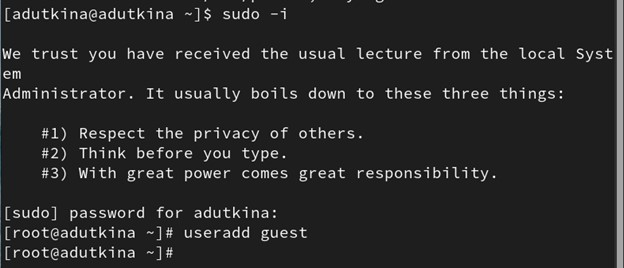{#fig:001 width=70%}

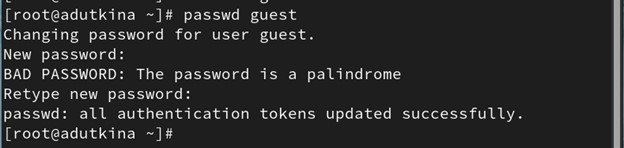{#fig:002 width=70%} 

Войдем в систему от имени пользователя guest и определим директорию, в которой находимся, командой pwd (рис. [-@fig:003]). Данная директория не является домашней, поэтому введем cd ~ (рис. [-@fig:004]).

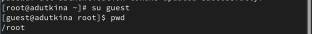{#fig:003 width=70%} 

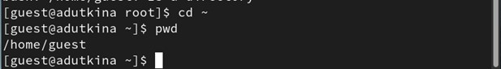{#fig:004 width=70%}

Уточним имя пользователя командой whoami, его группу, а также группы, куда входит пользователь, командой id (рис. [-@fig:005]). Команда id выводит подробную информацию про группы и id, в то же время команда groups выводит только название группы (рис. [-@fig:006]).

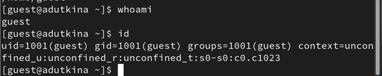{#fig:005 width=70%}

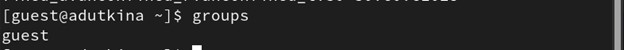{#fig:006 width=70%}

Просмотрим файл /etc/passwd командой cat /etc/passwd и найдем в нём свою учётную запись (рис. [-@fig:007]). Найденные значения совпадают с полученными в предыдущих пунктах.

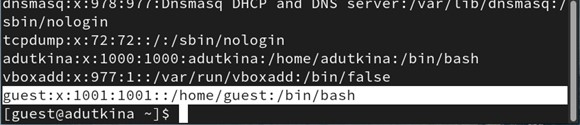{#fig:007 width=70%}

Определим существующие в системе директории командой ls -l /home/ (рис. [-@fig:008]). Нам удалось получить список поддиректорий, в них установлены права на чтение, запись и исполнение для владельцев этих директорий.

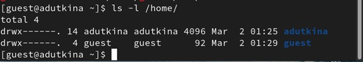{#fig:008 width=70%}

Проверим, какие расширенные атрибуты установлены на поддиректориях, находящихся в директории /home, командой lsattr /home (рис. [-@fig:009]). Нам удалось увидететь расширенные атрибуты только в своей директории

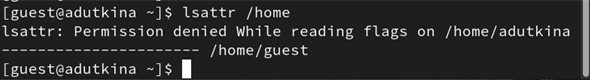{#fig:009 width=70%}

Создадим в домашней директории поддиректорию dir1 командой mkdir dir1 и определим командами ls -l и lsattr, какие права доступа и расширенные атрибуты были выставлены на директорию dir1 (рис. [-@fig:010]).

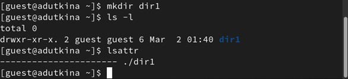{#fig:010 width=70%}

Снимим с директории dir1 все атрибуты командой chmod 000 dir1 и проверим с её помощью правильность выполнения команды ls -l (рис. [-@fig:011]).

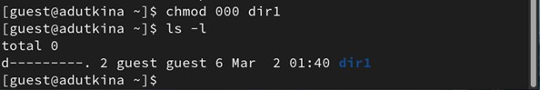{#fig:011 width=70%}

Попытаемся создать в директории dir1 файл file1 командой echo "test" > /home/guest/dir1/file1 (рис. [-@fig:012]). Нам не удалось этого сделать, так как мы сняли все права доступа к директории.

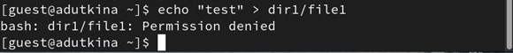{#fig:012 width=70%}

Командой ls -l /home/guest/dir1 можно определить, что файл file1 не находится внутри директории dir1 (рис. [-@fig:013]).

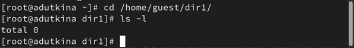{#fig:013 width=70%}

Заполним таблицу «Установленные права и разрешённые действия» [-@tbl:001], выполняя действия от имени владельца директории (файлов), определив опытным путём, какие операции разрешены, а какие нет. Если операция разрешена, в таблицу ставится знак «+», если не разрешена, знак «-».

: Установленные права и разрешенные действия {#tbl:001}

| Права директории | Права на файл | Создан. файла | Удал. файла | Запись в файл | Чтение файла | Смена директории | Просмотр файлов в директории | Переим. файла | Смена атрибутов файла |
|------------------|---------------|---------|---------|--------|--------|-------|--------|---------|------------|
| d--------- (000) | (000)         | -       | -       | -      | -      | -     | -      | -       | -          |
| d--x------ (100) | (100)         | -       | -       | -      | -      | +     | -      | -       | +          |
| drwx------ (700) | (700)         | +       | +       | +      | +      | +     | +      | +       | +          |

Теперь на основании этой таблицы заполним еще одну [-@tbl:002]

: Минимальные права для совершения операций {#tbl:002}

| Операция               | Минимальные права на директорию | Минимальные права на файл |
|------------------------|---------------------------------|---------------------------|
| Создание файла         | (700)                           | (700)                     |
| Удаление файла         | (700)                           | (700)                     |
| Чтение файла           | (700)                           | (700)                     |
| Запись файла           | (700)                           | (700)                     |
| Переименование файла   | (700)                           | (700)                     |
| Создание поддиректорий | (700)                           | (700)                     |
| Удаление поддиректорий | (700)                           | (700)                     |

# Выводы

В ходе лабораторной работы были получены практические навыки работы в консоли с атрибутами файлов, закрепление теоретических основ дискреционного разграничения доступа в современных системах с открытым кодом на базе ОС Linux1.

