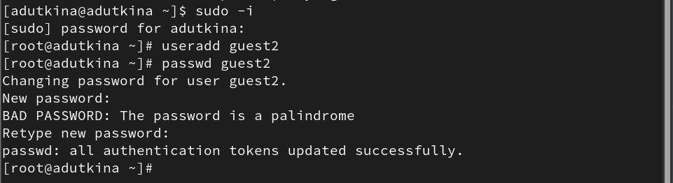
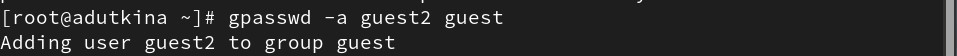
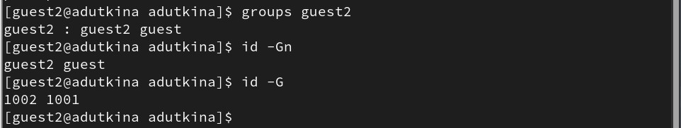
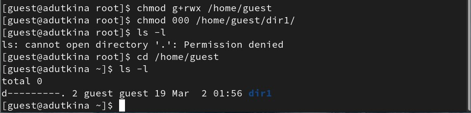

---
## Front matter
lang: ru-RU
title: Лабораторная работа №3
subtitle: Дискреционное разграничение прав в Linux. Два пользователя
author:
  - Уткина А. Д.
institute:
  - Российский университет дружбы народов, Москва, Россия
date: 16 марта 2024

## i18n babel
babel-lang: russian
babel-otherlangs: english

## Formatting pdf
toc: false
toc-title: Содержание
slide_level: 2
aspectratio: 169
section-titles: true
theme: metropolis
header-includes:
 - \metroset{progressbar=frametitle,sectionpage=progressbar,numbering=fraction}
 - '\makeatletter'
 - '\beamer@ignorenonframefalse'
 - '\makeatother'
---

# Информация

## Докладчик

:::::::::::::: {.columns align=center}
::: {.column width="70%"}

  * Уткина Алина Дмитриевна
  * студент НПИбд-02-22
  * Российский университет дружбы народов
  
:::
::: {.column width="30%"}

:::
::::::::::::::

# Вводная часть

## Цель работы

Целью данной работы является получение практических навыков работы в консоли с атрибутами файлов для групп пользователей.

# Выплнение работы

## Создание пользователя

- Создание пользователя и добавление его в группу

## Информация по группам пользователей

- вывод информации по группам для разных пользователей

## Работа с правами доступа

## Работа с правами доступа

: Минимальные права для совершения операций

| Операция               | Минимальные права на директорию | Минимальные права на файл |
|------------------------|---------------------------------|---------------------------|
| Создание файла         | (070)                           | (070)                     |
| Удаление файла         | (070)                           | (070)                     |
| Чтение файла           | (070)                           | (070)                     |
| Запись файла           | (070)                           | (070)                     |
| Переименование файла   | (070)                           | (070)                     |
| Создание поддиректорий | (070)                           | (070)                     |
| Удаление поддиректорий | (070)                           | (070)                     |

# Результаты

## Вывод

В ходе данной работы были получены практические навыки работы в консоли с атрибутами файлов для групп пользователей.

