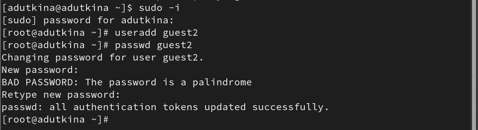
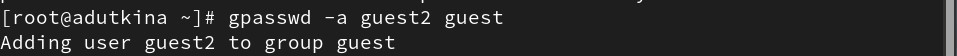
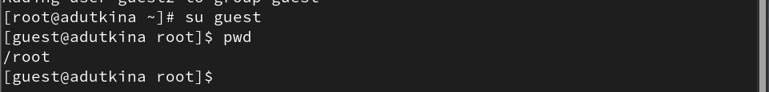
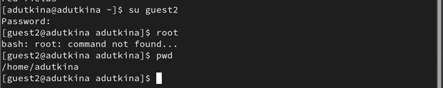
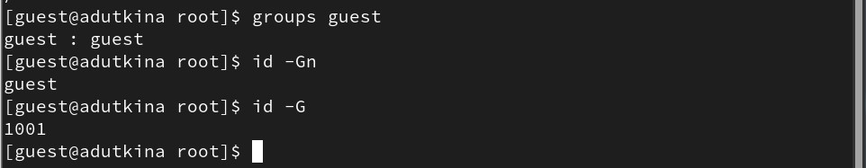
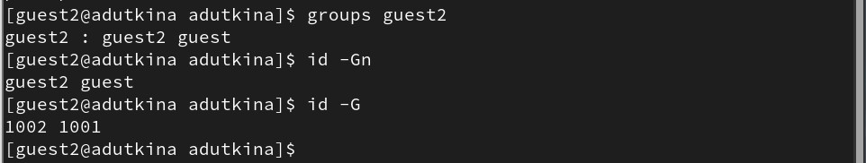
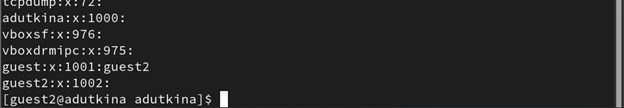
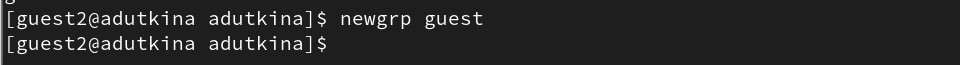
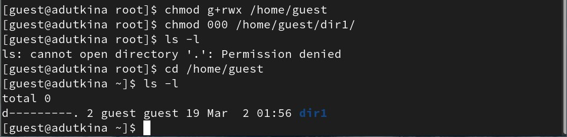

---
## Front matter
title: "Отчёт по лабораторной работе №3"
subtitle: "Дискреционное разграничение прав в Linux. Два пользователя"
author: "Уткина Алина Дмитриевна"

## Generic otions
lang: ru-RU
toc-title: "Содержание"

## Bibliography
bibliography: bib/cite.bib
csl: pandoc/csl/gost-r-7-0-5-2008-numeric.csl

## Pdf output format
toc: true # Table of contents
toc-depth: 2
lof: true # List of figures
lot: true # List of tables
fontsize: 12pt
linestretch: 1.5
papersize: a4
documentclass: scrreprt
## I18n polyglossia
polyglossia-lang:
  name: russian
  options:
	- spelling=modern
	- babelshorthands=true
polyglossia-otherlangs:
  name: english
## I18n babel
babel-lang: russian
babel-otherlangs: english
## Fonts
mainfont: PT Sans
romanfont: PT Sans
sansfont: PT Sans
monofont: PT Sans
mainfontoptions: Ligatures=TeX
romanfontoptions: Ligatures=TeX
sansfontoptions: Ligatures=TeX,Scale=MatchLowercase
monofontoptions: Scale=MatchLowercase,Scale=0.9
## Biblatex
biblatex: true
biblio-style: "gost-numeric"
biblatexoptions:
  - parentracker=true
  - backend=biber
  - hyperref=auto
  - language=auto
  - autolang=other*
  - citestyle=gost-numeric
## Pandoc-crossref LaTeX customization
figureTitle: "Рис."
tableTitle: "Таблица"
listingTitle: "Листинг"
lofTitle: "Список иллюстраций"
lotTitle: "Список таблиц"
lolTitle: "Листинги"
## Misc options
indent: true
header-includes:
  - \usepackage{indentfirst}
  - \usepackage{float} # keep figures where there are in the text
  - \floatplacement{figure}{H} # keep figures where there are in the text
---

# Цель работы

Целью данной работы является получение практических навыков работы в консоли с атрибутами файлов для групп пользователей.

# Выполнение лабораторной работы

В установленной операционной системе учётная запись пользователя guest уже создана при выполнении лабораторной работы №2. Аналогично ей создадим второго пользователя guest2 и зададим ему пароль (рис. [-@fig:001]).

{#fig:001 width=70%}

Добавим нового пользователя в группу guest (рис. [-@fig:002]).

{#fig:002 width=70%}

Осуществим вход в систему от двух пользователей на двух разных консолях: guest на первой консоли и guest2 на второй консоли. Для обоих пользователей командой pwd определим директорию, в которой находимся она совпадает с приглашением командной строки (рис. [-@fig:003]), (рис. [-@fig:004]).

{#fig:003 width=70%}

{#fig:004 width=70%}

Уточним имя пользователя, его группу, кто входит в неё и к каким группам принадлежит он сам. Определим несколькими командами, в какие группы входят пользователи guest и guest2 (рис. [-@fig:005]), (рис. [-@fig:006]).

{#fig:005 width=70%}

{#fig:006 width=70%}

Сравним полученную информацию с содержимым файла /etc/group (рис. [-@fig:007]).

{#fig:007 width=70%}

От имени пользователя guest2 выполним регистрацию пользователя guest2 в группе guest командой newgrp guest (рис. [-@fig:008]).

{#fig:008 width=70%}

От имени пользователя guest изменим права директории /home/guest, разрешив все действия для пользователей группы, снимим с директории /home/guest/dir1 все атрибуты и проверим правильность снятия атрибутов (рис. [-@fig:009]).

{#fig:009 width=70%}

Меняя атрибуты у директории dir1 и файла file1 от имени пользователя guest и делая проверку от пользователя guest2, заполним таблицу "Установленные права и разрешенные действия для групп" [-@tbl:001], определив опытным путём, какие операции разрешены, а какие нет. Если операция разрешена «+», если не разрешена «-». 

На основании заполненной таблицы определим те или иные минимально необходимые права для выполнения пользователем guest2 операций внутри директории dir1 и заполним таблицу "Минимальные права для совершения операций" [-@tbl:002].

: Установленные права и разрешенные действия для групп {#tbl:001}

| Права директории | Права на файл | Создан. файла | Удал. файла | Запись в файл | Чтение файла | Смена директории | Просмотр файлов в директории | Переим. файла | Смена атрибутов файла |
|------------------|---------------|---------|---------|--------|--------|-------|--------|---------|------------|
| d--------- (000) | (000)         | -       | -       | -      | -      | -     | -      | -       | -          |
| d--x------ (100) | (100)         | -       | -       | -      | -      | +     | -      | -       | +          |
| drwx------ (070) | (070)         | +       | +       | +      | +      | +     | +      | +       | +          |

: Минимальные права для совершения операций {#tbl:002}

| Операция               | Минимальные права на директорию | Минимальные права на файл |
|------------------------|---------------------------------|---------------------------|
| Создание файла         | (070)                           | (070)                     |
| Удаление файла         | (070)                           | (070)                     |
| Чтение файла           | (070)                           | (070)                     |
| Запись файла           | (070)                           | (070)                     |
| Переименование файла   | (070)                           | (070)                     |
| Создание поддиректорий | (070)                           | (070)                     |
| Удаление поддиректорий | (070)                           | (070)                     |

# Выводы

В ходе данной работы были получены практические навыки работы в консоли с атрибутами файлов для групп пользователей.

