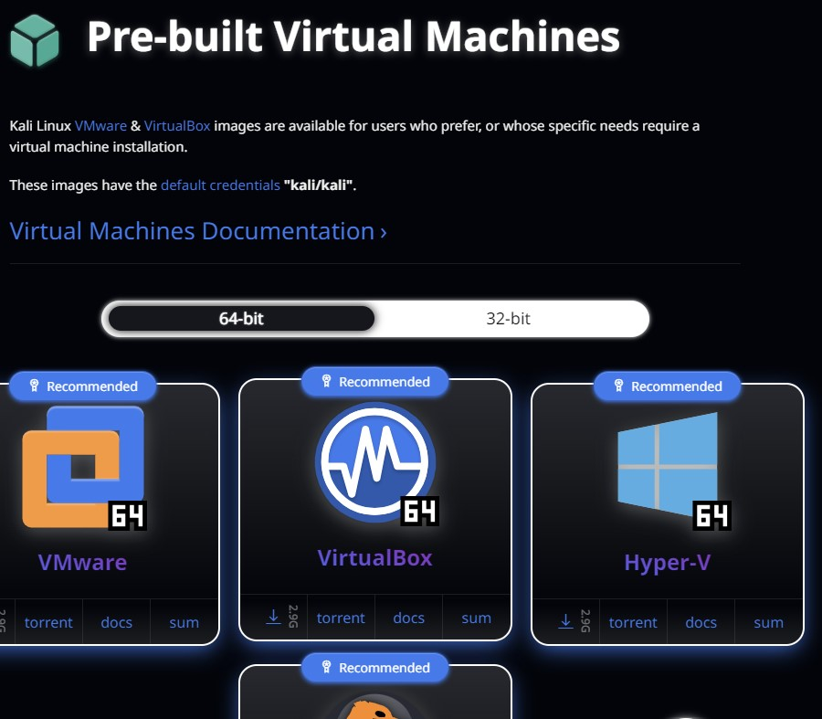
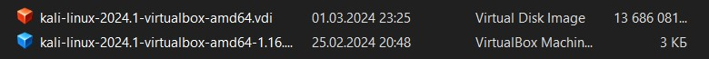
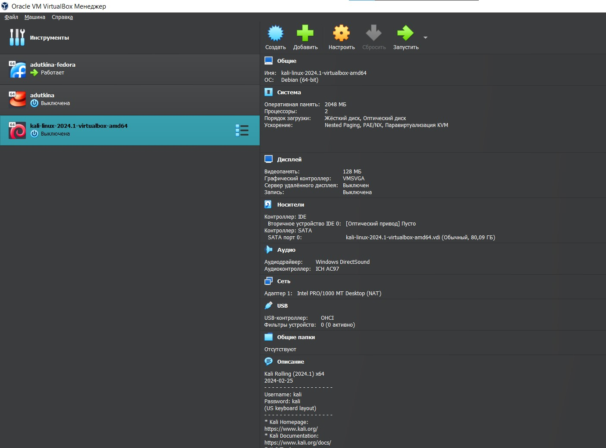
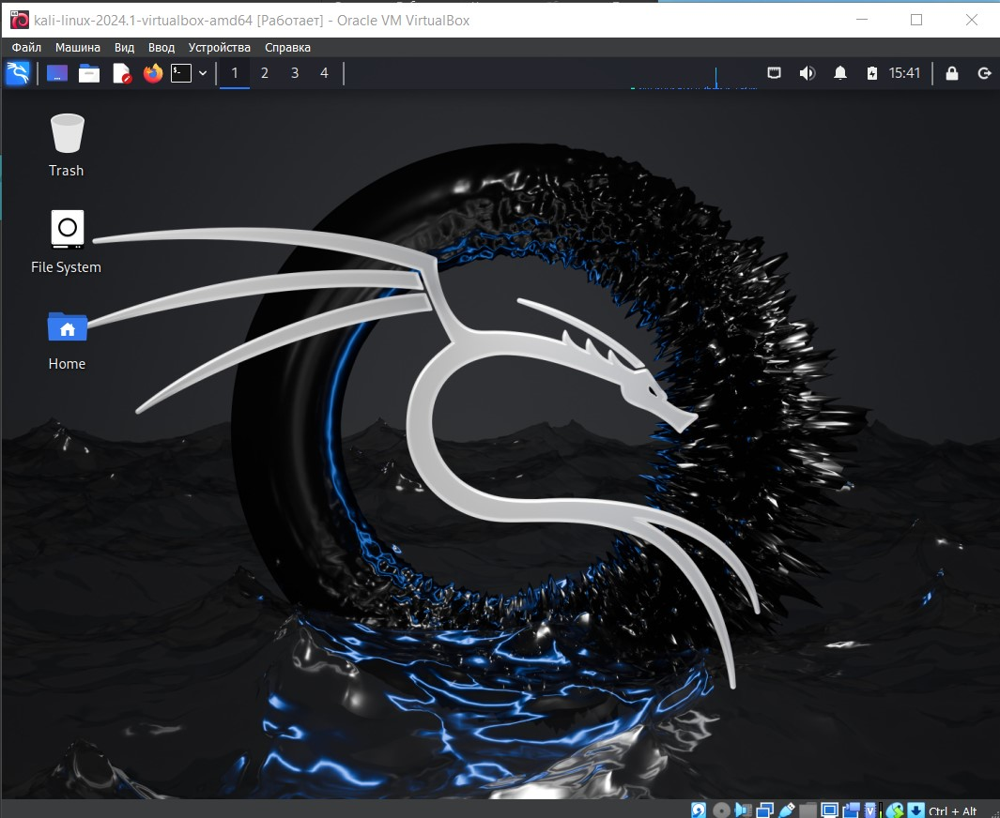

---
## Front matter
lang: ru-RU
title: Индивидуальный проект
subtitle: Этап 1
author:
  - Уткина А. Д.
institute:
  - Российский университет дружбы народов, Москва, Россия
date: 02 марта 2024

## i18n babel
babel-lang: russian
babel-otherlangs: english

## Formatting pdf
toc: false
toc-title: Содержание
slide_level: 2
aspectratio: 169
section-titles: true
theme: metropolis
header-includes:
 - \metroset{progressbar=frametitle,sectionpage=progressbar,numbering=fraction}
 - '\makeatletter'
 - '\beamer@ignorenonframefalse'
 - '\makeatother'
---

# Информация

## Докладчик

:::::::::::::: {.columns align=center}
::: {.column width="70%"}

  * Уткина Алина Дмитриевна
  * студент НПИбд-02-22
  * Российский университет дружбы народов

:::
::: {.column width="30%"}

:::
::::::::::::::

# Вводная часть

## Цели и задачи

- Установить дистрибутив Kali Linux в виртуальную машину.

# Выполнение работы

## Скачивание дистрибутива

Скачиваем дистрибутив с сайта https://www.kali.org/

## Создание и запуск машины

## Создание и запуск машины

## Создание и запуск машины

## Создание и запуск машины

# Результаты

## Вывод

В ходе работы были получены навыки установки операционной системы kali linux в виртуальную машину. 

