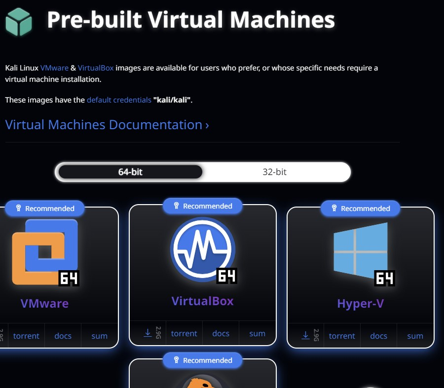
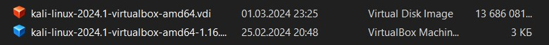
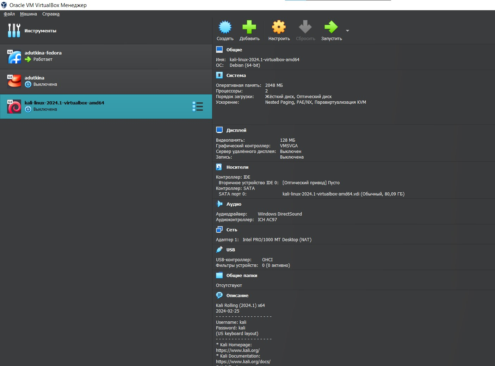
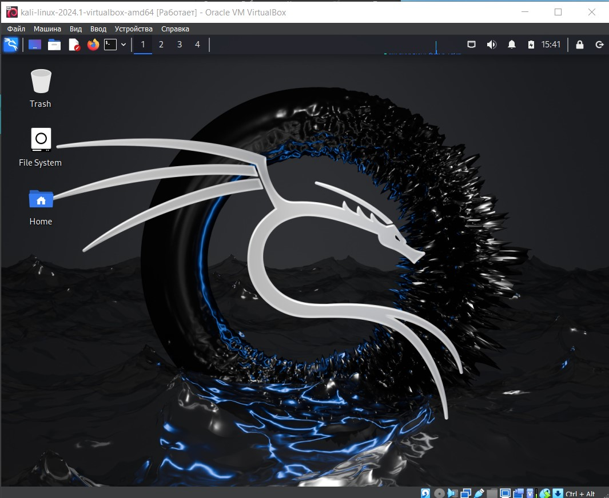

---
## Front matter
title: "Отчёт по индивидуальному проекту"
subtitle: "Этап 1"
author: "Уткина Алина Дмитриевна"

## Generic otions
lang: ru-RU
toc-title: "Содержание"

## Bibliography
bibliography: bib/cite.bib
csl: pandoc/csl/gost-r-7-0-5-2008-numeric.csl

## Pdf output format
toc: true # Table of contents
toc-depth: 2
lof: true # List of figures
fontsize: 12pt
linestretch: 1.5
papersize: a4
documentclass: scrreprt
## I18n polyglossia
polyglossia-lang:
  name: russian
  options:
	- spelling=modern
	- babelshorthands=true
polyglossia-otherlangs:
  name: english
## I18n babel
babel-lang: russian
babel-otherlangs: english
## Fonts
mainfont: PT Sans
romanfont: PT Sans
sansfont: PT Sans
monofont: PT Sans
mainfontoptions: Ligatures=TeX
romanfontoptions: Ligatures=TeX
sansfontoptions: Ligatures=TeX,Scale=MatchLowercase
monofontoptions: Scale=MatchLowercase,Scale=0.9
## Biblatex
biblatex: true
biblio-style: "gost-numeric"
biblatexoptions:
  - parentracker=true
  - backend=biber
  - hyperref=auto
  - language=auto
  - autolang=other*
  - citestyle=gost-numeric
## Pandoc-crossref LaTeX customization
figureTitle: "Рис."
tableTitle: "Таблица"
listingTitle: "Листинг"
lofTitle: "Список иллюстраций"
lotTitle: "Список таблиц"
lolTitle: "Листинги"
## Misc options
indent: true
header-includes:
  - \usepackage{indentfirst}
  - \usepackage{float} # keep figures where there are in the text
  - \floatplacement{figure}{H} # keep figures where there are in the text
---

# Цель работы

Получить навыки установки операционной системы kali linux в виртуальную машину

# Задание

Установить дистрибутив Kali Linux в виртуальную машину.

# Выполнение лабораторной работы

Скачиваем дистрибутив для VirtualBox с сайта https://www.kali.org/ (рис. [-@fig:001]). В архиве находятся два файла (рис. [-@fig:002]). Переходим через один из них (.vbox) и у нас автоматически добавляется новая машина (рис. [-@fig:003]). Там уже были установлены некоторые параметры, имя пользователя и пароль можно найти в описании.

{#fig:001 width=70%}

{#fig:002 width=70%}

{#fig:003 width=70%}

После запуска машины появляетя окно аавторизации, где мы вводим логин и пароль (рис. [-@fig:004]). После мы попадаем на рабочий стол (рис. [-@fig:005]).

{#fig:004 width=70%}

{#fig:005 width=70%}

# Выводы

В ходе работы были получены навыки установки операционной системы kali linux в виртуальную машину. 

