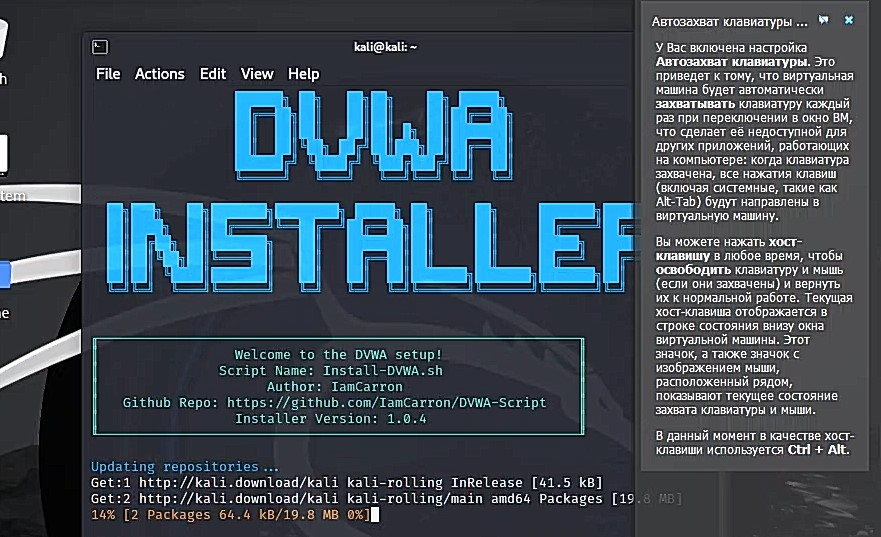

---
## Front matter
lang: ru-RU
title: Индивидуальный проект. Этап 2
subtitle: Установка DVWA
author:
  - Уткина А. Д.
institute:
  - Российский университет дружбы народов, Москва, Россия
date: 16 марта 2023

## i18n babel
babel-lang: russian
babel-otherlangs: english

## Formatting pdf
toc: false
toc-title: Содержание
slide_level: 2
aspectratio: 169
section-titles: true
theme: metropolis
header-includes:
 - \metroset{progressbar=frametitle,sectionpage=progressbar,numbering=fraction}
 - '\makeatletter'
 - '\beamer@ignorenonframefalse'
 - '\makeatother'
---

# Информация

## Докладчик

:::::::::::::: {.columns align=center}
::: {.column width="70%"}

  * Уткина Алина Дмитриевна
  * НПИбд-02-22
  * Российский университет дружбы народов
  
:::
::: {.column width="30%"}

:::
::::::::::::::

# Вводная часть

## Цель работы

Целью данной работы является установка DVWA в гостевую систему к Kali Linux. 

## DVWA 

DVWA имеет три уровня безопасности, они меняют уровень безопасности каждого веб приложения в DVWA:

- Невозможный;
- Высокий;
- Средний;
- Низкий.

# Выполнение работы

## Установка DVWA

Установка программы с репозитория https://github.com/digininja/DVWA

# Результаты

## Вывод

В ходе данной работы мы установили пакет DVWA и изучили некоторую информацию о нем.

